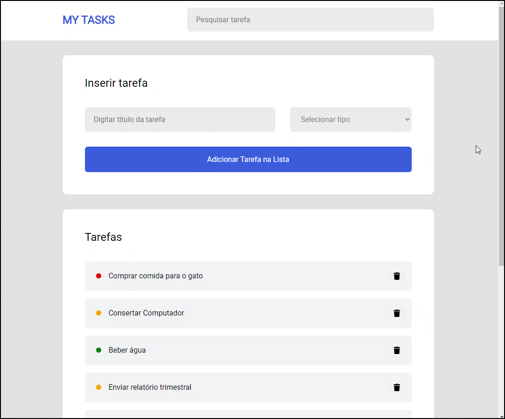

# Projeto: TO DO list

  

## Introdução

O formulário contém dois campos: um campo de texto para digitar o título da tarefa e um menu suspenso para selecionar a prioridade da tarefa. O menu suspenso tem três opções: "Urgente", "Importante" e "Normal".

A lista de tarefas é representada por uma série de elementos <li> que contêm o título da tarefa e um botão de exclusão. Cada tarefa é exibida em uma caixa retangular com um círculo de cor de fundo que representa sua prioridade. As tarefas "Urgentes" têm uma cor de fundo vermelha, as "Importantes" têm uma cor de fundo laranja e as "Normais" têm uma cor de fundo verde.

No entanto, o código ainda precisa ser atualizado com a estilização e a interação via DOM para permitir que o usuário adicione novas tarefas à lista dinamicamente e as visualize na página.

## Descrição do Projeto

- Estilização inicial

- Lógica da função renderElements

- Lógica da função createTaskItem

- Evento "Adicionar Tarefa"

- Evento "Remover Tarefa"

- ! O campo para Pesquisar Tarefa não foi o foco da tarefa e está posicionado somente para efeitos de estilização.